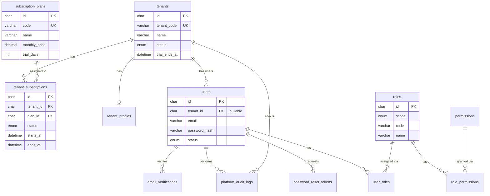
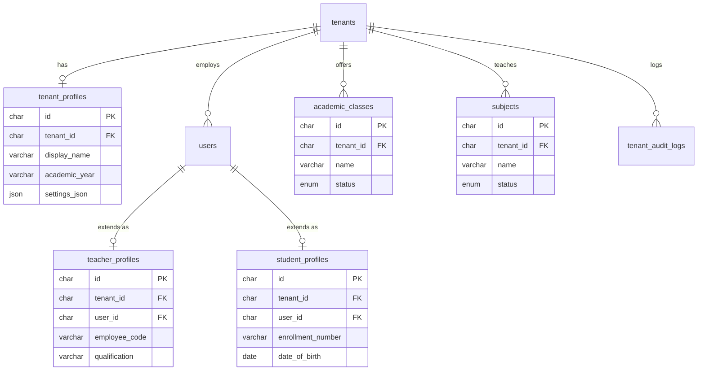
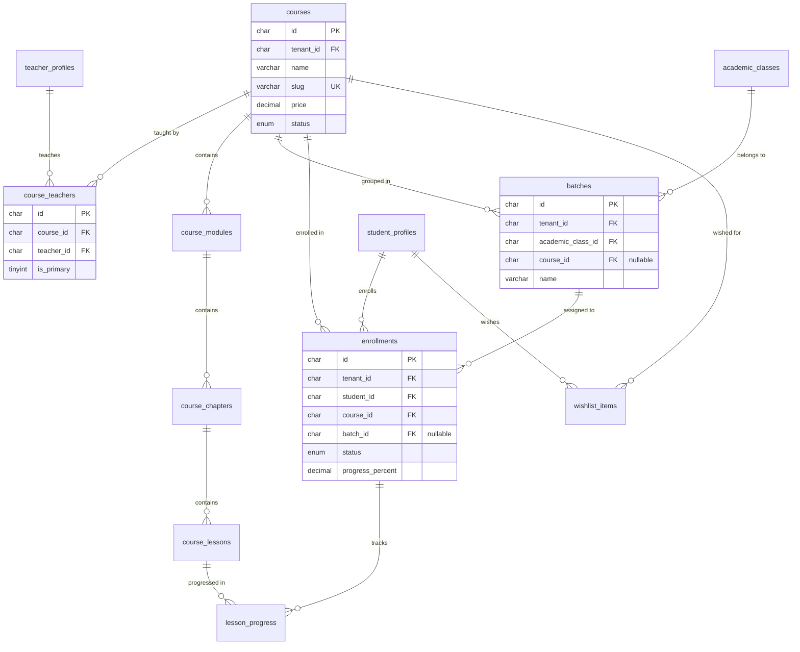
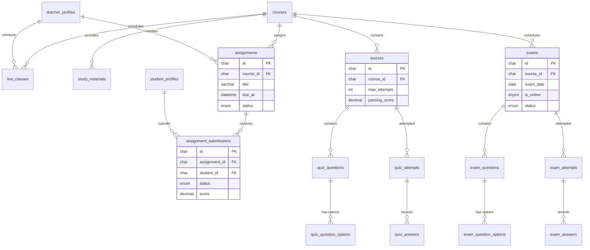
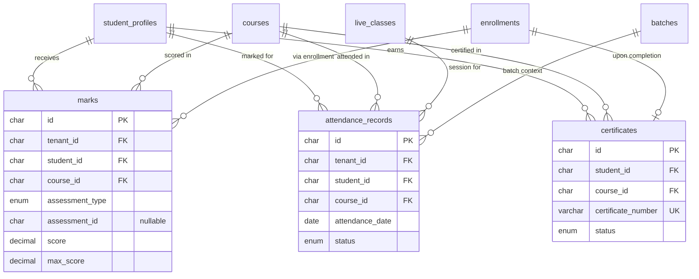
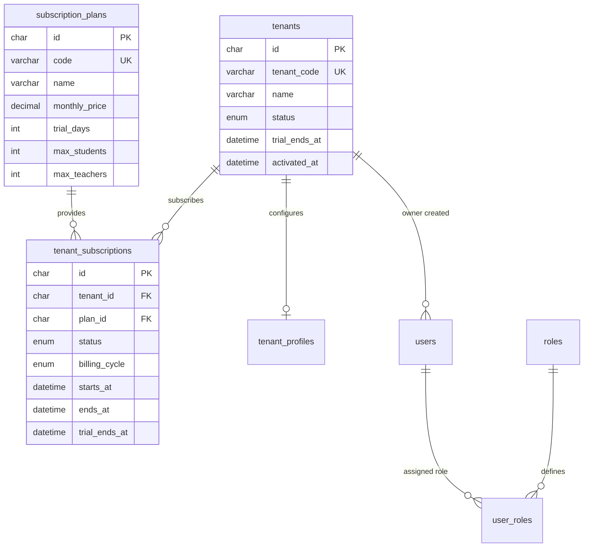
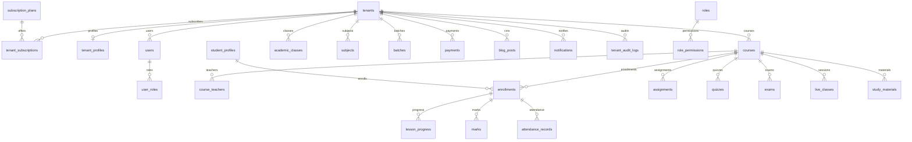

# 10 — Entity-Relationship Diagrams

Seven ERDs covering the complete database. All diagrams use Mermaid syntax.

---

## ERD 1: Platform / Master Admin

**Explanation:** Platform tables manage the SaaS business. `tenants` is the central registry. Each tenant has subscriptions, a profile, and users. RBAC is managed through roles, permissions, and user_roles. Platform audit logs track all administrative actions.

---

## ERD 2: Tenant / Academy Core

**Explanation:** Each tenant has one academy profile, many users (with role-specific profiles), academic classes (grades), and subjects. Teacher and student profiles extend the base user record with role-specific fields.

---

## ERD 3: Courses / Teachers / Students / Batches

**Explanation:** Courses are the central academic entity. Teachers are assigned via M:N junction. Curriculum is a 3-level tree. Students enroll in courses (optionally in a batch). Progress is tracked per lesson per enrollment.

---

## ERD 4: Classes / Assignments / Quizzes / Exams

**Explanation:** Learning operations branch from courses. Assignments have submissions reviewed by teachers. Quizzes and exams are separate modules (Q-11) with their own question/attempt/answer structures. Live classes and study materials support the learning experience.

---

## ERD 5: Attendance / Marks / Results

**Explanation:** Marks are polymorphic — they can reference assignments, quizzes, exams, or be manually entered. Attendance is recorded per student per session with duplicate prevention. Certificates are issued upon course completion.

---

## ERD 6: Subscriptions / Tenant Management

**Explanation:** SaaS subscription lifecycle. Master Admin creates tenants, assigns plans, and manages trial/active/suspended states. Plan limits (max_students, max_teachers) enforce subscription tiers.

---

## ERD 7: Complete Database Relationship Overview

**Explanation:** High-level view of all major relationships. `tenants` is the root for all tenant data. `courses` is the central academic hub connecting teachers, students, assessments, and learning materials. `enrollments` is the junction connecting students to the learning experience.

---

## Diagram Notes

- All `id` columns are `CHAR(36)` UUIDs
- All tenant tables include `tenant_id` FK (not shown in every diagram for readability)
- `created_at`, `updated_at`, `deleted_at` audit columns omitted from diagrams
- See [11-table-catalog.md](./11-table-catalog.md) for complete column definitions
